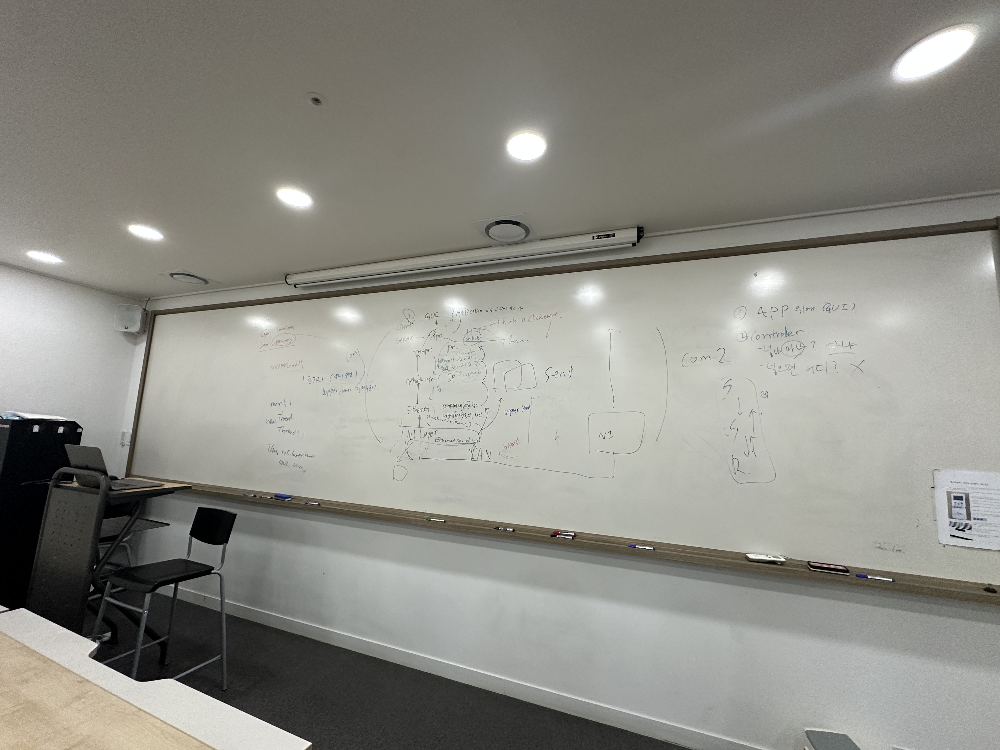

# 📝 Meeting Report

- **회의 날짜:** 2025-04-24
- **회차:** 3회차
- **회의 참가자:** : @doo1011, @can019, @Hoyoung9509, @judy78799, SeungminShin97, @daamont

---

## 📌 회의 내용
- 각자 UML 피그마에 그려오기
- 다음 회의 때 취합 예정

---

## ✅ 주요 결정 사항

- [각자 UML 피그마에 그려오기]
- [다음 주 다음 회의 때 취합 예정, 회의 후 구현 시작]

---

## 🔄 Action Items
- none
---

## 💬 비고

