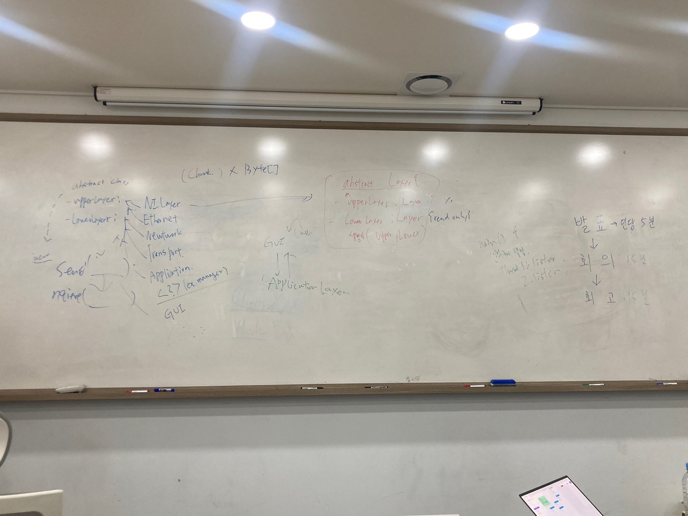

# 📝 Meeting Report

- **회의 날짜:** 2025-05-01
- **회차:** 4회차
- **회의 참가자:** : @doo1011, @can019, @Hoyoung9509, @judy78799, @SeungminShin97, @daamont

---

## 📌 회의 내용
- 각자 작성한 UML 공유
- 공통된 요소를 정리하여 concrete 설계안 도출
- 회고
---

## ✅ 주요 결정 사항
- [다음주까지 설계 진행]
- [Main class에서 의존성 주입]
- [Main class의 main method에서 NiLayer, GUILayer(혹은 applicationLayer) 대기 메서드 호출]
---

## 🔄 Action Items
| 담당자 | 할 일 | 마감일 |
|--------|--------|--------|
| 전체 | 피그마에 KPT 작성 | 2025-05-02 |
| 전체 | 적어놓은 이슈에 대해 답변 달기 | 다음 회의 전 (2025-05-08) |
| 전체 | 구현 시 브랜치 전략 및 역할 분담 방안 구상 | 다음 회의 전 (2025-05-08) |
| [@doo1011] | 클래스 다이어그램 취합 및 미해결 이슈 표시 | 다음 회의 전 (2025-05-08) |
| [@judy78799] | Oranization profile 사진 등록 | 다음 회의 전 (2025-05-08) |
---

## 💬 비고
