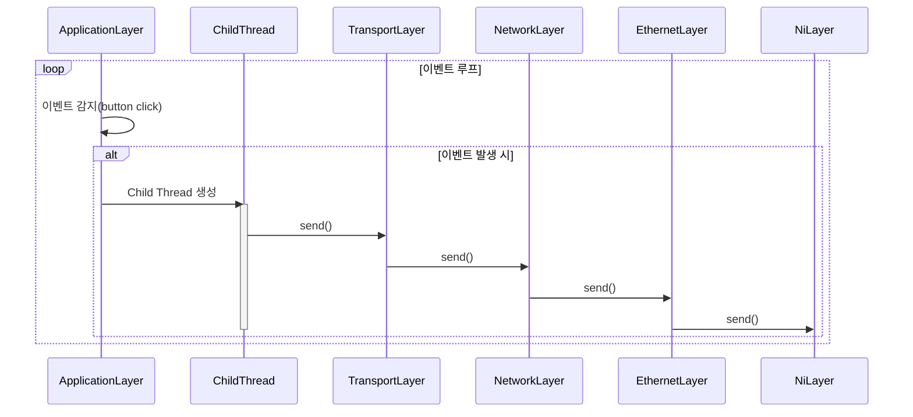

# NiLayer to Application Layer
## Medtadata
- 작성자: 정유성
- 버전: v0.1
- 최초 작성: 2025-04-25 13:48
- 마지막 수정: 2025-04-25 13:48

## Description
- ApplicationLayer에서 message 전송시 하위 레이어에서 어떻게 처리되는지 표현한 다이어그램

## Legend
- **->>** : 동기 메시지(메서드 호출)
- **-->>** : 비동기 메시지/응답 (여기서는 사용하지 않음)
- **loop** : 반복 동작(여기서는 이벤트 루프)
- **alt** : 조건 분기(여기서는 "이벤트 발생 시"만 실행)
- **Child Thread 생성** : 새로운 Thread(Worker)가 버튼 클릭 이벤트마다 만들어져 하위 계층 send() 실행
- **activate/deactivate ChildThread** : ChildThread의 생성(활성화)과 종료(비활성화) 표현
- **ApplicationLayer** : 사용자의 입력 이벤트(버튼 클릭) 대기 및 처리 담당 계층
> ※ 모든 메시지는 상위 계층에서 하위 계층으로 순차적으로 전달됨  
> ※ ChildThread는 한 번의 이벤트마다 새로 생성되어, send() 체인이 끝나면 종료됨  

## Reference
[ApplicationLayer listen() 호출 (엔트리포인트) sequence diagram](./EntryPoint.md)

## Diagram
