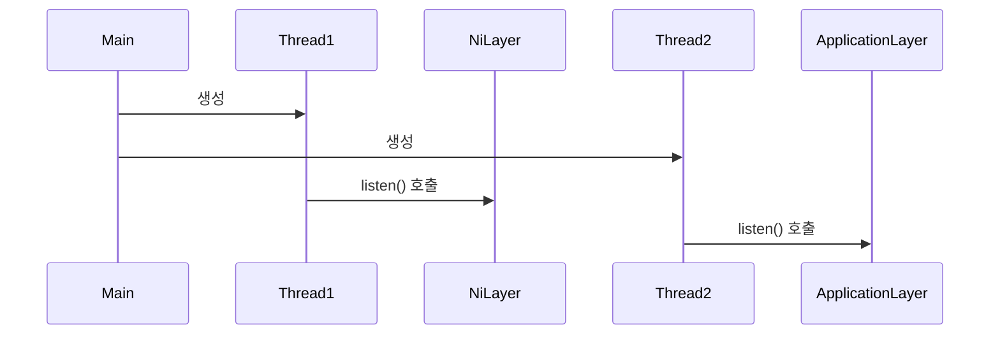

# NiLayer to Application Layer
## Medtadata
- 작성자: 정유성
- 버전: v0.1
- 최초 작성: 2025-04-25 12:55
- 마지막 수정: 2025-04-25 12:59

## Description
- Main (or 다른 엔트리 클래스)에서 사용자의 message send와 패킷 수신 대기 시작
- 2개의 이벤트를 기다리며 다른 스레드에서 실행

## Legend
- → : 호출(동기)

## Reference
- [Application -> NiLayer 패킷 전달 흐름 Sequence Diagram](./ApplicationLayer_to_NiLayer.md)
- [NiLayer -> Application 패킷 전달 흐름 Sequence Diagram](./NiLayer_to_ApplicationLayer.md)

## Diagram
