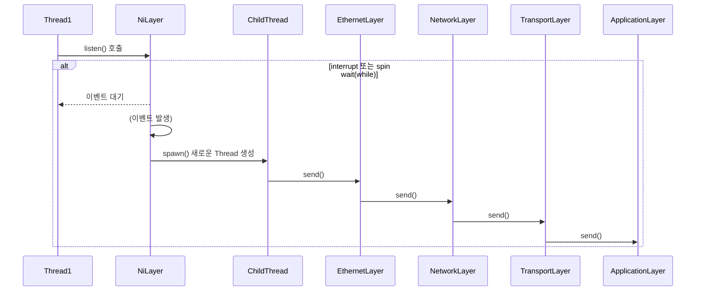

# NiLayer to Application Layer
## Medtadata
- 작성자: 정유성
- 버전: v0.1
- 최초 작성: 2025-04-25 12:45
- 마지막 수정: 2025-04-25 12:45

## Description
- 이 다이어그램은 NiLayer에서 ApplicationLayer로 신호가 전달되는 전체 프로세스를 시각화한 것임.
- 각 레이어의 send() 호출 관계를 중심으로 TCP/IP 4 Layer 구조를 설명함

## Legend
- → : 호출(동기)
- alt : 이벤트 대기/조건 분기 표현

## Reference
- [NiLayer.listend() 호출 과정](./EntryPoint.md)

## Diagram

